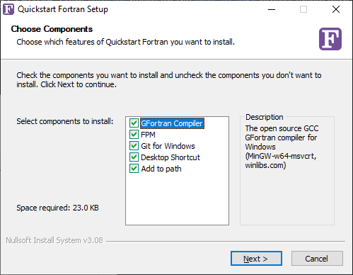

# Quickstart Fortran on Windows

__An easy Windows installer and launcher for GFortran and the Fortran Package Manager__

Download the latest installer from the [__Releases Page__](https://github.com/LKedward/quickstart-fortran/releases)

__Note: the installer takes a little while to startup due to it size, please be patient.__



## Features

- Installs locally, __no adminstrator account__ required
- Optionally add everything to the PATH for the local user
- Includes:
  - GCC-GFortran 11.2.0
  - Fortran Package Manager v0.5.0
  - Git for Windows v2.35.2 (_needed for fpm_)
  - OpenBLAS (BLAS/LAPACK) v0.3.20-1
  - GNU make v4.3
- Extra utility commands
  - `intel-setvars` to initialise the Intel OneAPI environment (if installed)
  - `setup-stdlib` to build and install the latest version of the Fortran Standard Library 

## FAQ

### Do I need to be administrator to install this?

No, the installer will install files to the `AppData` directory for the current user (`C:\Users\<user>\AppData\Local`).

### What is 'Add to path' and do I need it?

The 'Add to path' installer option will update the Windows PATH variable for the local user
so that all the installed components are available to other applications.
This means that you can call `gfortran` or *fpm* from any command window or code editor/IDE.

Alternatively, you may create an 'isolated' installation by unchecking the 'Add to path' option
when installing. In this case, the installed programs are only made available when you use the
'Quickstart Fortran' command line shortcut added to the desktop and start menu.

### Can I use this with the Intel OneAPI Compiler?

Yes. The installation adds a helper command `intel-setvars` to setup the intel environment
(this must be called each time you open a new command window.).
The helper script assumes OneAPI is installed at `C:\Program Files (x86)\Intel\oneAPI`.

After setting up the intel environment, you may use `ifort` with *fpm* by appending
`--compiler ifort` to each *fpm* command or by setting the environment variable:

```batch
> set FPM_COMPILER=ifort
```

### How can I install `stdlib` with this?

First, run the installer, making sure that GFortran, fpm and Git are selected. After install,
open up the commmand window using the `Quickstart Fortran` shortcut on the desktop or in the start menu.
At the command window type `setup-stdlib` and press ENTER.
This will fetch the latest version of `stdlib` and install it to the local GFortran installation.

__Note: The `setup-stdlib` script only works with the GFortran installation provided with this installer - it cannot
currently detect existing GFortran or Intel fortran installations.__

### How do I compile with BLAS/LAPACK?

The optimized OpenBLAS library is included with the GCC installation.
Use the link flag `-lopenblas` or add the following to your `fpm.toml` file:

```toml
[build]
link = "openblas"
```

### How do I uninstall?

There is an uninstall program which may be launched from the start menu:

```
Start menu > All programs > Quickstart Fortran > Uninstall
```

## About

The installer is built using the [Nullsoft Scriptable Install System](https://nsis.sourceforge.io/Download).

See [`quickstart-fortran-installer.nsi`](./quickstart-fortran-installer.nsi) for the configuration file and
[`make_installer.yml`](./.github/workflows/make_installer.yml) for the Github actions workflow.

The GNU Compiler Collection v11.2.0
is sourced from [WinLibs](https://winlibs.com/) based on the [MinGW-w64](https://www.mingw-w64.org/) project linked with MSVCRT.


